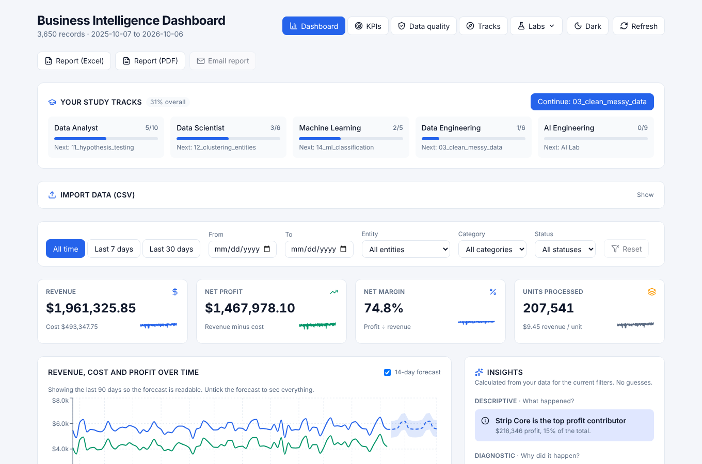
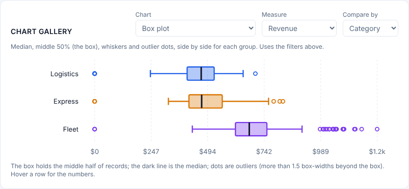
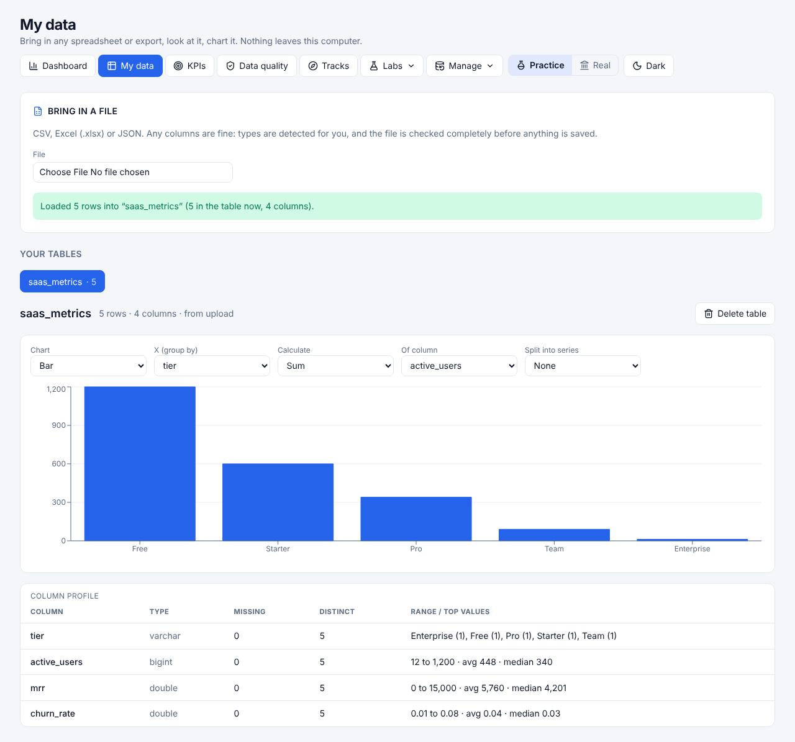

# Business Intelligence Dashboard








FastAPI + DuckDB analytics engine (`backend/`) and a Next.js dashboard (`frontend/`).

## Run it

**Backend** (port 8020)
```
cd backend
python -m venv .venv && .venv\Scripts\activate      # Windows
pip install -r requirements.txt
uvicorn app.main:app --port 8020 --reload
```

**Frontend** (port 3012)
```
cd frontend
npm install
npm run dev
```
Open http://localhost:3012. Set `NEXT_PUBLIC_API_URL` (see `frontend/.env.example`) if the API is elsewhere.

## Learning lab
See **LEARNING.md** for how this project maps to BI topics (SQL, Python, Tableau, ETL/ELT, forecasting...).
* **Dashboard**: KPIs, filters, trend + forecast, insights, drill-down, and **Excel / PDF reports** of the current view.
* **KPIs** (`/kpis`): turn a metric into a KPI with a target, direction, window and warning band.
* **Data quality** (`/quality`): nine checks (nulls, negatives, orphans, duplicates, date gaps...) with sample rows.
* **Chart gallery** (main dashboard, under the entity chart): a dropdown of 12 charts over your filtered data: pie, donut, treemap, ranked bar, Pareto, radar, funnel, stacked area, waterfall, histogram, box plot and bubble. Pick the measure (revenue, cost, profit, units, duration) and what to group by.
* **Your data in every track** (main dashboard, collapsible): one import feeds all ten careers; this card checks whether your data is big enough for each career's exercises. Each career dashboard shows the same check. The pipeline monitor can run on "Your uploaded data", and `postgres_practice/load_data.py --uploaded` loads it into Postgres.
* **Company engagement** (`/company`, second item in the nav, and a card on the home page): the plan for being hired to do every discipline for one company. Four phases, 22 deliverables, each linked to the dashboard where it is done. Progress is detected from your workspace's own data where possible and ticked by you where not; Practice and Real keep separate plans. See docs/COMPANY_ENGAGEMENT.md.
* **How-to manual + AI agent in every discipline** (docs/AGENTS_AND_MANUALS.md): each track opens on a step-by-step manual with buttons that jump to the right tool, and has a search bar to ask its AI agent questions or give it instructions. Agents can draft requirements, risks, backlog items, KPIs and catalog entries for you to approve; they can't change anything themselves, and they respect your AI privacy mode.
* **Eight career tracks**: Analyst, Scientist, ML, Data Engineering (with **Database admin** and **Data governance** tabs), AI, **Project & Product**, **Systems Analyst** and **Full Stack Developer** (API map and in-app request tester, code scaffolds from your tables, codebase stats, stack and config facts; docs/FULL_STACK_DEVELOPMENT.md). See docs/PROJECT_PRODUCT_MANAGEMENT.md, docs/SYSTEMS_ANALYSIS.md and docs/DBA_AND_GOVERNANCE.md. Example data for the PM and requirements views loads in Practice only; Real never gets invented data.
* **Study widget** (main dashboard): progress bars for the ten careers and a **Continue** button to your next step. Progress is stored in the DuckDB file.
* **Career dashboards** (`/tracks/analyst`, `/scientist`, `/ml`, `/engineering`, `/ai`): a practice dashboard per career (analyst KPIs and quality score; weekend t-test, KMeans segments and correlations; ML experiment log; pipeline health; AI usage) plus a learning-path checklist and portfolio ideas.
* **Tracks** (`/tracks`): Data Analyst, Data Scientist, Machine Learning, Data Engineering and AI Engineering, each with real tools, an ordered path through this project, and portfolio projects.
* **Labs** menu:
  * **SQL Lab** (`/lab`): read-only SQL console, 16 graded exercises, and saved queries (kept in your browser).
  * **Python** (`/python`): Jupyter launch card and 14 notebooks in `python_practice/notebooks/` (basics 00-07; analyst, statistics, clustering, ML and MLflow 10-15) with self-checking exercises.
  * **ML Lab** (`/ml`): train regression/classification models (scikit-learn) with a time-based split, baselines, cross-validation, permutation importance and plain-English warnings.
  * **AI Lab** (`/ai`): an agent that answers questions by writing read-only SQL. Put any of `GOOGLE_API_KEY`, `OPENAI_API_KEY`, `ANTHROPIC_API_KEY` in `backend/.env` (see `.env.example`). Questions are routed by difficulty: simple to Gemini first (free tier), medium (comparisons, trends, summaries, drafts) to OpenAI first, complex or code questions to Claude first, each falling back to the others if a key is missing, a cap is reached or a provider errors. The discipline agents use the same rules. Daily caps and automatic fallback spread the load; you can also force one model.
  * **Glossary** (`/glossary`): 18 metrics and concepts with formula, runnable SQL and common pitfalls.
  * **Pipeline monitor** (`/pipeline`): run the medallion pipeline (clean or messy data) and watch freshness, quarantine and health checks.
  * **Apache** (`/apache`): Spark, Airflow and Superset examples in a dropdown (`apache_practice/`).
  * **Star schema** (`/schema`): fact/dimension diagram, grain, additive vs non-additive measures.
  * **SCD lab** (`/scd`): change a category and compare Type 1 (overwrite) with Type 2 (history kept).
  * **Quiz** (`/quiz`): 25 questions from your class topics, with explanations and best scores.
* `python_practice/`: six runnable scripts (file formats, pandas, data cleaning, ETL vs ELT, forecasting, charts).
* `data_engineering/`: a medallion pipeline (DuckDB + Parquet, incremental and idempotent, with tests) and a dbt-duckdb project. See its README.
* `ai_engineering/`: five exercises (structured output, RAG, evals, MCP server, prompt injection) that run offline with a stub or live with an API key.
* `postgres_practice/`: the same star schema in Postgres 16 via Docker (constraints, indexes, read-only role). See its README.
* `.github/workflows/ci.yml`: backend, labs, Postgres and frontend jobs.
* `scripts/check_ai_keys.py`: one command that tests each AI key end to end (SQL answer, chart, and a refused write). Run it after adding keys to `backend/.env`.
* `scripts/send_report.py`: emails the report; schedule it with cron or Task Scheduler (set `BI_SMTP_*` and `BI_REPORT_TO` in `backend/.env`).
* `scripts/generate_sample_data.py`: a realistic year of data (clean or messy) for practice.
* `docs/TABLEAU.md`: a Tableau practice guide. `docs/BI_TOOLS.md`: Superset, Power BI and Metabase notes (untested).

## Using it for real data
There are two workspaces, switched with **Practice / Real** at the top of every page: separate database files, so practice data and your own data can never mix. Real starts empty, has AI off by default, and takes a backup before anything destructive. Study progress is shared between them.
* **My data** (`/data`): import any CSV, Excel or JSON (any columns; types, dates and delimiters are detected), then chart it (bar, line, area, pie, donut, histogram, box plot, scatter). Or map its columns onto the operations dashboards, with fixed values for fields your file lacks.
* **Sources** (`/sources`): save a file in a folder, a web link, or a read-only Postgres/SQLite query, and refresh it on a schedule. Refreshes are staged and swapped in as one step; a refresh that would shrink a table below half its size is refused. Passwords stay in `backend/.env`.
* **Settings & backups** (`/settings`): per-workspace AI access (off, summaries only, full) and columns the AI must never see; manual and daily backups, restore, download.
* **Activity log** (`/activity`): imports, exports, emails, AI questions, refreshes, backups.
Full guide, limits and hosting notes: **docs/REAL_USE.md**. There are no logins: it is built for one person on one machine.

## Load your own data (operations layout)
Use **Import data (CSV)** on the dashboard (or `POST /api/ingest/csv`). Download the template from the same panel.
Required columns: `record_date, entity_id, revenue, operational_cost, units_processed`.
Optional: `entity_name, category, baseline_target, duration_minutes, status, fact_id`.
Files are fully validated first; a bad row rejects the whole file with line-numbered errors, so you never get a half-import.
* **Add / update**: upserts by `fact_id` (auto-generated from the row content when absent, so re-uploading the same file doesn't duplicate).
* **Replace**: deletes all existing records and entities first (this also removes the demo data).

## API
| Endpoint | Purpose |
|---|---|
| `GET /api/analytics/meta` | filter options, date range |
| `GET /api/analytics/summary` | KPIs + previous-period comparison |
| `GET /api/analytics/timeseries` | daily revenue / cost / profit / units |
| `GET /api/analytics/by-entity` | per-entity totals, margin, cost vs budget |
| `GET /api/analytics/records` | paginated, sortable row-level drill-down |
| `GET /api/analytics/records/export` | CSV download |
| `GET /api/analytics/insights` | insights across the four analytics types |
| `GET /api/analytics/forecast` | revenue forecast with 95% range and backtest |
| `GET /api/analytics/recommendations` | prescriptive actions with estimated impact |
| `GET /api/analytics/scatter`, `/heatmap` | data for the extra chart types |
| `GET /api/charts/breakdown`, `/distribution`, `/bubble` | chart gallery data (pie, histogram, box plot...) |
| `GET /api/dataset` | rows, date range and per-career readiness of the current data |
| `POST /api/sql/run`, `GET /api/sql/schema` | read-only SQL Lab |
| `GET /api/sql/exercises`, `POST .../{id}/check` | graded SQL exercises |
| `GET /api/export/{operations\|facts\|entities\|dates}?format=csv\|tsv\|json\|xml\|xlsx\|parquet` | downloads |
| `GET /api/report?format=xlsx\|pdf` | report of the filtered view |
| `GET/POST /api/kpis`, `DELETE /api/kpis/{id}`, `GET /api/kpis/metrics` | KPI builder |
| `GET /api/search?q=` | Ctrl+K command palette: manual steps, deliverables, tracks |
| `GET /api/ai/usage` | AI calls per provider and tier; cost only if `BI_PRICE_*` is set |
| `GET /api/agent-evals`, `POST /api/agent-evals/run` | re-runnable agent checks (route free, live opt-in) |
| `GET/POST /api/quizzes/{track}` | checkpoint quiz per manual |
| `GET /api/company/export?format=xlsx\|pdf` | export the Company plan |
| `GET/POST /api/company/snapshots`, `POST .../snapshots/ai-brief` | weekly progress snapshots and an agent-written brief |
| `PUT /api/company/deliverables/{id}/meta` | notes and due date on a deliverable |
| `GET /api/alerts`, `PUT /api/alerts/config`, `POST /api/alerts/check`, `POST /api/alerts/test-email` | email alerts for real data |
| `GET/POST /api/dba/drill` | backup restore drill |
| `GET/POST/DELETE /api/pm/time` | time tracker feeding earned value |
| `GET /api/compare` | Practice vs Real side by side (read only) |
| `GET /api/quality` | data-quality checks |
| `GET /api/scd/state`, `/compare`, `POST /api/scd/change`, `/reset` | slowly changing dimension sandbox |
| `GET /api/python/notebooks[/{file}]`, `GET /api/apache/tools` | notebook and Apache examples |
| `GET /api/ml/options`, `POST /api/ml/train` | ML Lab |
| `GET /api/ai/status`, `POST /api/ai/ask` | AI Lab (needs API key) |
| `GET /api/tracks`, `GET /api/tracks/file?path=` | career tracks |
| `GET /api/tracks/{id}/dashboard` | per-career practice dashboard |
| `GET/PUT /api/progress` | study progress |
| `GET /api/glossary` | metrics glossary |
| `GET /api/pipeline`, `POST /api/pipeline/run` | pipeline monitor |
| `GET /api/report/email/status`, `POST /api/report/email` | emailed report |
| `POST /api/ingest/csv?mode=append\|replace` | CSV import |
| `GET/POST /api/workspaces[/active]`, `GET/PUT /api/workspaces/{name}/settings` | Practice / Real, AI privacy, backup settings |
| `POST /api/data/preview`, `/import`, `/map-operations`; `GET /api/data/tables[/{t}/profile\|rows\|chart]` | My data |
| `GET/POST /api/sources`, `POST /api/sources/test`, `POST /api/sources/{id}/run` | saved sources and refresh |
| `GET/POST /api/backups`, `POST /api/backups/restore` | backups |
| `GET /api/audit` | activity log |
| `/api/pm` (overview, items, sprints, risks, OKRs, `product-analytics`, `example`) | Project & Product track: RICE/WSJF, velocity, burndown, flow, critical path, earned value, risk EMV, OKRs |
| `/api/sysanalyst` (requirements, `dictionary`, `process`, `feasibility`, `calc/*`) | Systems Analyst track: traceability, data dictionary + Mermaid ER, queueing, availability, cost-benefit, capacity, TELOS |
| `GET /api/manuals/{track}`, `PUT /api/manuals/{track}/steps/{step}` | How-to manuals and your ticks |
| `GET /api/agents/{track}`, `POST /api/agents/{track}/chat` | Per-discipline AI agent |
| `/api/fullstack/*` (api-map, request, scaffold, codebase, stack) | Full Stack Developer track |
| `/api/company` (overview, brief, deliverables) | Company engagement plan |
| `GET /api/dba/health`, `/api/dba/benchmarks`, `POST /api/dba/checkpoint`, `/api/dba/verify-backup` | Data Engineering > Database admin |
| `/api/governance/*` (catalog, assets, pii-scan, protect, lineage, controls, access) | Data Engineering > Data governance |
| `GET /api/ingest/template` | CSV template |
| `POST /api/ml/compare`, `GET /api/ml/runs[/export.csv]`, `POST /api/ml/runs/compare\|mlflow`, `PATCH/DELETE /api/ml/runs/{id}` | ML Lab: compare every model on one split, experiment tracker, optional MLflow copy |
| `/api/models` (register, `{name}/card`, `.../versions/{v}/stage`, `{name}/predict`, `{name}/drift`) | Model registry, serving and input-drift check |
| `/api/hub`, `PUT /api/hub/{table}/notes` | Dataset hub: health grade, notes and tags |
| `/api/dq` (kinds, rules, run, suggest, history) | Data quality rules (Great Expectations style); failures raise an alert |
| `/api/workflows` (sources, explain, run, save-table, CRUD) | Workflow builder (KNIME style) with SQL and pandas output |
| `/api/pipelines` (CRUD, run, history) | Pipelines (Airflow/Prefect style): dependencies, retries, schedule |
| `GET /api/ops`, `GET /api/ops/llm`, `GET /metrics` | Ops monitor, LLM monitoring, Prometheus text endpoint |
| `/api/security/*` (audit, logs, headers, cert, ports, hash, password, totp, incidents) | Cybersecurity track: defensive tools only |
| `/api/net/*` (subnet, split, vlsm, contains, overlaps, summarize, config, capture, dns, tcp, transfer, bdp, reference) | Network Engineer track: calculators plus text readers; no scanners |
| `/api/it/*` (tickets, assets, events, checklists, capacity, availability, raid, cheats) | IT Specialist track: hand-filled helpdesk and inventory, calculators |
| `POST /api/sources/web-tables`; source kind `html_table` | Read one table from a public https page |
| `POST /api/web/read`, `GET/PUT /api/web/bookmarks` | Web panel: text reader view and saved bookmarks |
| `GET /api/setup` | First-run checklist, computed from what really exists |
| `POST /api/notebook/export` | Build a ready-to-run `.ipynb` from SQL Lab, a workflow or ML Lab settings |
| `GET/POST /api/views`, `DELETE /api/views/{id}` | Saved dashboard views (filters, hidden sections, order) |
| `GET /api/lineage/kpi/{id}` | What feeds a KPI: columns, rules, workflows, pipelines, sources |
| `GET /api/models/{name}/drift/history` | Every drift check kept for the chart |
| `GET/PUT /api/weekly`, `POST /api/weekly/send` | "What changed" paragraph and optional weekly email |
| `GET /api/actions`, `POST /api/actions/{id}/run` | Safe Ctrl+K actions (need `confirm: true`) |
| `GET /api/packs`, `POST /api/packs/{id}/load` | Made-up sample data packs (Practice only) |
| `GET /api/export-all` | One zip: every table as CSV plus settings JSON |
| `GET /api/kb?q=`, `GET /api/toolmap` | Knowledge search (TF-IDF keyword) and the Tool map |
| `GET /api/pm/calendar`, `/api/pm/rules[/run]` | PM calendar view and simple board automations |

All analytics endpoints accept `date_from, date_to, entity_id, category, status`. Interactive docs at `/docs`.

## Docker (optional)
`docker compose up --build` starts the backend on 127.0.0.1:8020 and the frontend on 127.0.0.1:3000, with data in the `bi_data` volume and keys read from `backend/.env`. `docker compose --profile postgres up` also starts the practice Postgres on 127.0.0.1:5433, and `docker compose --profile notebooks up` starts a local Jupyter on 127.0.0.1:8888 (token `bi-notebooks`, or set `JUPYTER_TOKEN`) with the warehouse mounted read-only. For Grafana, point your own Prometheus at `http://localhost:8020/metrics`. The files are checked by tests and CI builds them, but they are only as verified as your own first run.

## Tests
```
cd backend
pip install -r requirements-dev.txt
pytest
```

## What has been tested against the real thing
Tested: email over a real SMTP server (STARTTLS, SSL, none; Excel and PDF attachments open), Airflow 3.1.8 (`airflow dags test` ran all five tasks to success), Superset 6.1.0 installed with pip (CSV upload, temporal column and all four metrics matched this dashboard), Spark, and the Postgres lab against Postgres 16.
Real-data features: 25 new backend tests (imports, types, mapping, workspace isolation, sources against a local web server, SQLite and a real Postgres 16 including the server refusing writes, backups and restore, AI privacy rules; the Postgres one runs when `BI_TEST_PG_URL` is set, and I ran it against Postgres 16) and a browser pass over every new page in Chromium. Live Gemini, OpenAI and Claude calls were verified on your machine with `scripts/check_ai_keys.py`.
Not tested: Docker Compose and the Superset Docker commands (Docker Hub was unreachable), Tableau and Power BI (desktop apps).

## Notes
* Margin is **total profit / total revenue** (weighted), not an average of per-row margins.
* Insights are computed (period change, linear trend, median/MAD outliers, entity highlights), never LLM-estimated.
* `baseline_target` is treated as a **cost budget per record** (inferred: in the demo data each entity's average cost per record ≈ its baseline). "Cost vs budget" is average cost ÷ budget − 1, so positive = over budget. Change `_by_entity` in `backend/app/routers/analytics.py` if it means something else.
* Config via env vars: `BI_DB_PATH`, `BI_CORS_ORIGINS`, `BI_SEED_DEMO`, and for real-data use `BI_SCHEDULER`, `BI_INBOX_DIR`, `BI_SOURCE_DIRS`, `BI_BACKUP_DIR` (see `backend/.env.example`).


## Update 14: nine additions, and what each honestly is

| Addition | Honest label |
|---|---|
| First-run checklist | Ticks are computed from real state; you can hide the card. |
| Backup alert | "No backup" is yellow in Practice (data can be regenerated) and red in Real. |
| Send to a notebook | Writes a valid `.ipynb` that opens the warehouse read-only; not run or tested inside Jupyter here. |
| Saved views | Filters plus section visibility and order, stored per workspace. |
| Lineage | Built from definitions inside this app only; can't see exports or sheets made elsewhere. |
| Drift history | Inputs only (PSI), same limits as the drift check; not a measure of accuracy. |
| Weekly report | Rule-based "what moved", not an AI and not a cause. Email needs SMTP and the backend running; text only. |
| Palette actions | Four safe actions, each confirmed and audited; none deletes data. |
| Sample packs | Deterministic made-up data (no resident data); Practice only. |
| Export everything | CSV plus JSON; API keys are never included; the zip isn't encrypted. |


## Update 13: what was added, and what each thing honestly is
| Feature | Where | Honest label |
|---|---|---|
| Cybersecurity track | `/tracks/security` | Defensive only. Detections are leads, not verdicts. Offensive tools are taught, not built. |
| Network Engineer track | `/tracks/network` | Subnet/VLSM, config review (pattern checks, not CIS), capture reader (text only), DNS and one-port TCP check on public hosts. Scanners and live capture are taught, not built. |
| IT Specialist track | `/tracks/itsupport` | Helpdesk with SLA clocks and an inventory, both typed by hand; event-log reader; checklists; capacity, availability and RAID. RAID is not a backup. |
| Model comparison, tracker, registry | `/ml` | One time split can't crown a winner; ties under 0.02 are flagged. Drift looks at inputs only. |
| Dataset hub and quality rules | `/hub` | A catalogue and rule checker for imported tables, not a full governance product. |
| Workflow builder | `/workflow` | Six step types over one table. It writes SQL and the equivalent pandas. |
| Pipelines | `/pipelines` | In-process, one at a time. Scheduled runs only while the backend runs. |
| Ops and LLM monitor | `/ops` | Request numbers reset on restart. Failed AI calls aren't logged, so errors are a floor. |
| Log explorer | `/logs` | One file at a time. Not an indexer. |
| Diagram studio | `/diagrams` | Our own small renderer for a Mermaid-style flowchart subset. |
| Knowledge search | `/knowledge` | Keyword (TF-IDF) ranking. Matches words, not meaning. |
| Web panel | every page (Web button, bottom right) | Live view is an iframe on YOUR browser's internet; many sites refuse embedding, so use Reader (text via the backend) or New tab. Don't sign in to anything important in it. |
| Tool map | `/toolmap` | Which job-ad tools we cover, partly cover, only teach, or leave out (cloud, paid, offensive). |
| Web table source | `/sources` | One public https table. No JavaScript rendering. Private addresses are refused. |
| PM calendar and automations | PM track | Rules run when you press Preview or Run; Preview changes nothing. |

Not built on purpose: cloud platforms (Snowflake, Databricks, AWS, Azure, GCP, Kubernetes, Terraform), R and SAS, paid tools, logins, and offensive security tools.
